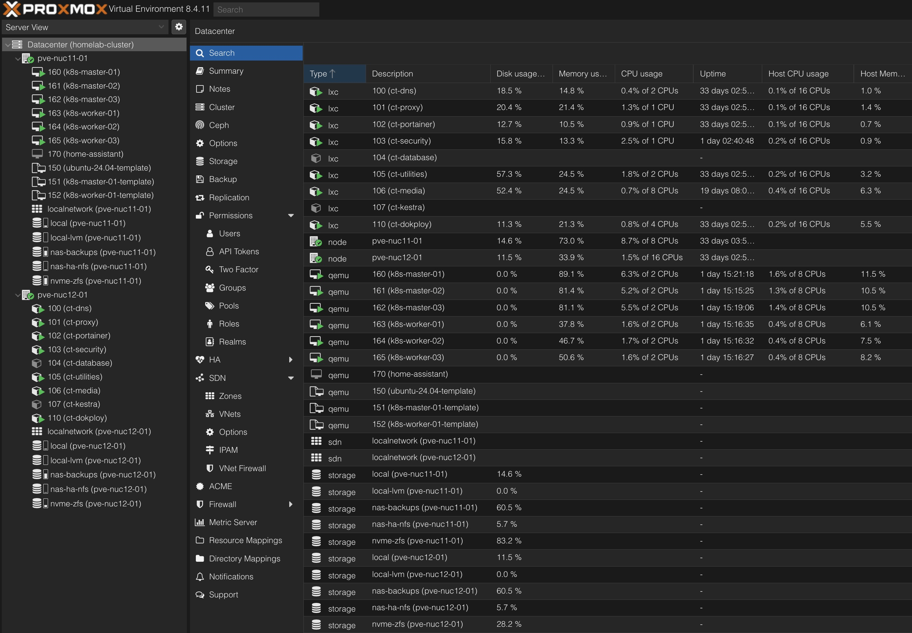
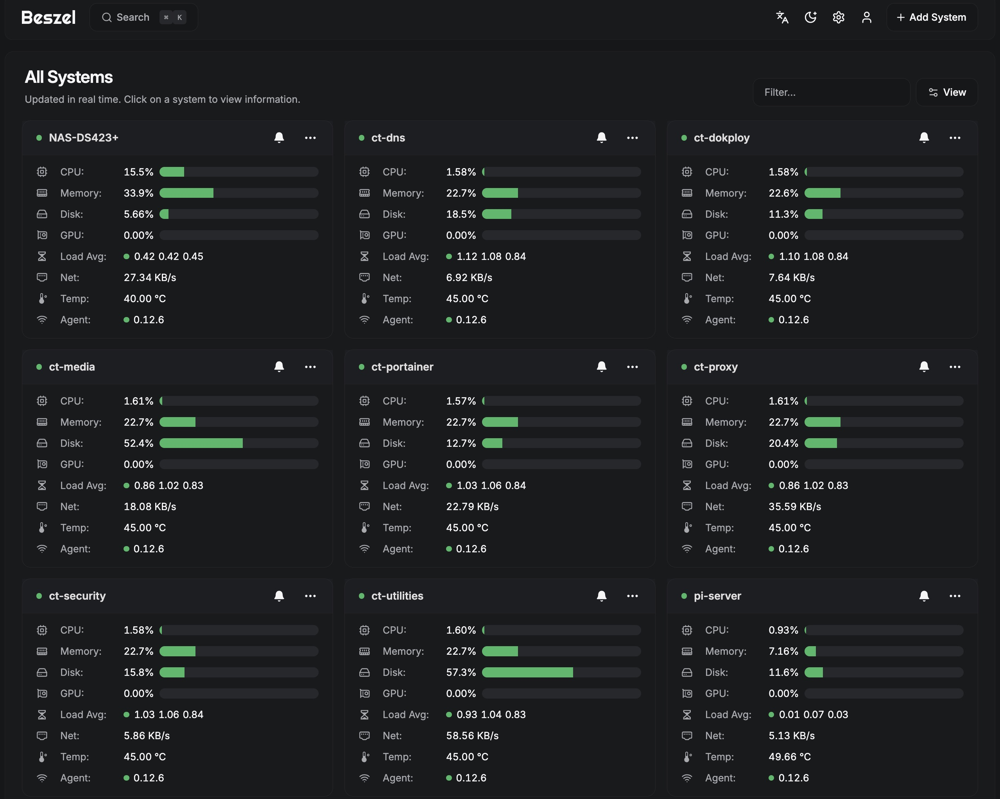
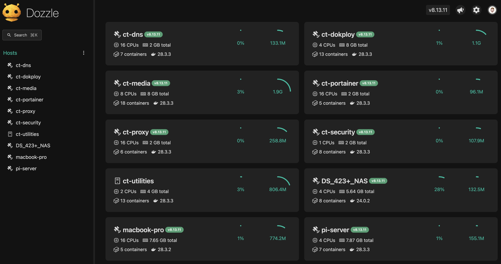
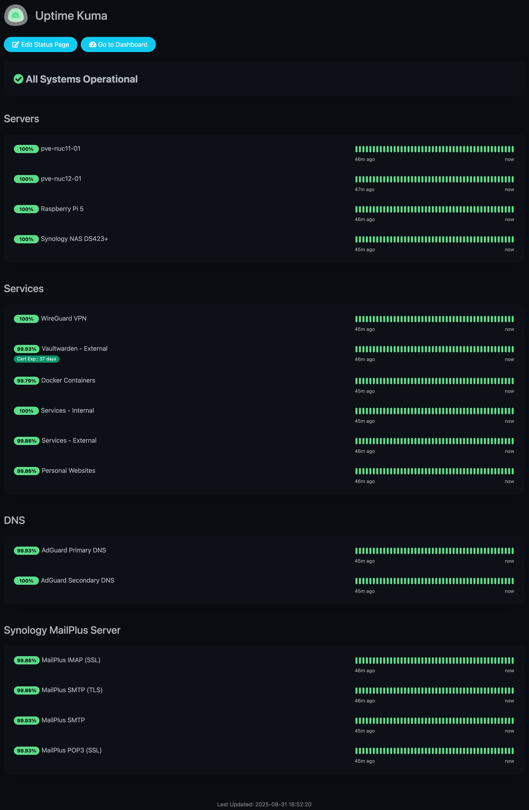
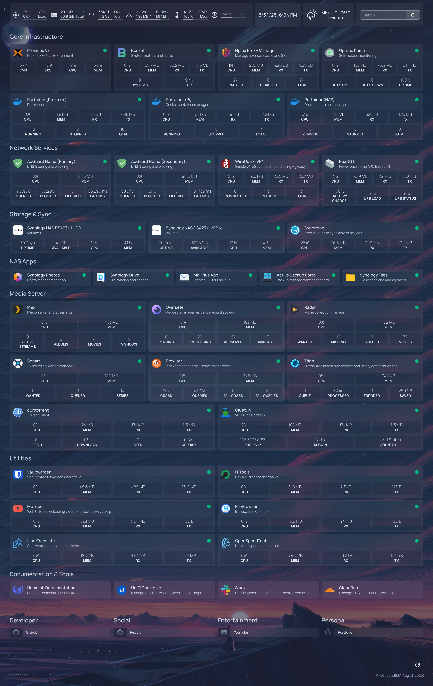

# Homelab – Cloud-Inspired Infrastructure

[](https://github.com/av1155/homelab/actions/workflows/ci.yaml)

> **TL;DR:**
> This homelab is a **production-like environment** designed for **high availability, automation, observability, and resilience**.
> It demonstrates hands-on experience with **Proxmox clustering, Kubernetes, Docker, GitOps, CI/CD, Cloudflare Zero Trust, backups, and monitoring**.
> All services are defined as code in this repo.

This project is my **personal lab** and represents the real-world DevOps/SRE skills I bring:

- Automating deployments with **GitOps & CI/CD**
- Designing for **high availability and disaster recovery**
- Operating **secure, cloud-centric infrastructure**
- Building **observable, scalable, reproducible systems**

---

## 🚀 Skills Snapshot

- **Infrastructure & Clustering** – Proxmox HA, Kubernetes, Docker, ZFS, Synology NAS
- **Automation & IaC** – GitOps, GitHub Actions, Portainer Stacks, Dokploy, (planned: Terraform modules for Cloudflare/AWS)
- **Observability & Ops** – Uptime Kuma, Dozzle, Kestra, (planned: Prometheus + Grafana)
- **Networking & Security** – Cloudflare Zero Trust, VLANs, WireGuard VPN, firewalls
- **Backup & DR** – ZFS replication, NAS + cloud sync, Cloudflare R2 object storage

---

## 📈 Stats at a Glance

- **GitOps:** 11 stacks · 28 containers
- **Portainer-managed fleet (all environments):** 29 stacks · 95 containers across 11 Docker environments
- **Resilience:** **RTO ≤ 3m** (Proxmox HA), **RPO ≈ 15m** (ZFS replication)
- **Monitoring:** 64 checks in Uptime Kuma
- **Availability snapshot:** Core infra **100%** · Exposed Services **99.79%** · Personal Websites **99.93%**

---

## 🖥️ Compute & Clustering

- **Proxmox 2-node HA cluster** with Raspberry Pi quorum device (HA failover; ZFS snapshots/replication)
- **Workload separation**:
    - **LXCs** → lightweight Dockerized services (Portainer managed)
    - **VMs** → Kubernetes cluster (**3 control planes + 3 workers**)

_Proxmox Dashboard:_


---

## ⚙️ Deployment & Automation

- **GitOps with Portainer**
    - Stacks reconciled directly from GitHub
    - GitHub Actions: linting, Compose validation, secret scanning (TruffleHog)
    - Host-level secret injection (no secrets in Git)
    - Portainer runs in a dedicated highly available LXC, with **Portainer Agents deployed across all nodes/devices**, enabling centralized, single-interface management of the entire fleet

- **Per-host baseline agents (host-level deployment, centrally controlled):**
    - `portainer-agent` - centralized Docker management
    - `beszel-agent` - metrics & alerting
    - `dozzle-agent` - log aggregation
    - `docker-socket-proxy` - secure Docker API access
    - `watchtower` - scheduled image updates & Slack reporting
    - Deployed on **11 Docker environments** → contributes to the **fleet total of 29 stacks / 95 containers**

- **CI/CD with Dokploy**
    - Webhook-triggered deployments for self-developed applications (Flask, Next.js, static sites, etc.), enabling seamless push-to-deploy workflows
    - Docker Swarm cluster deployments with horizontal scaling via Dokploy agents
    - **Automated database backups** stored in **Cloudflare R2 (S3-compatible object storage)**, ensuring durability and disaster recovery

---

## 📈 Monitoring & Observability

The homelab uses a **multi-layer monitoring stack** to provide real-time insights into infrastructure, containers, and uptime.

### 🖥️ Beszel

**Beszel** provides lightweight, modern monitoring and alerting.

- **Agents deployed** on all LXC containers, the NAS (DS423+), and the Raspberry Pi quorum device.
- Central dashboard for metrics:
    - CPU, memory, disk, network, GPU, load averages, and temperatures.
- **SMTP-based alerting** thresholds:
    - System downtime (10m)
    - CPU >80% (10m)
    - Memory >80% (10m)
    - Disk >80% (10m)
    - Temperature >85°C (10m)

_Beszel Dashboard:_  


---

### 📜 Dozzle

**Dozzle** gives real-time visibility into Docker container logs.

- **Dozzle Agents** run on all nodes, forwarding logs to a central dashboard.
- Makes debugging and operational awareness fast and accessible.

_Dozzle Logs View:_  


---

### 🌍 Uptime Kuma

**Uptime Kuma** provides external and internal uptime monitoring.

- Tracks availability of exposed services, internal apps, and infrastructure components.
- 64 checks configured for homelab services.
- Complements Beszel (resource monitoring) and Dozzle (logs) with black-box availability monitoring.

_Uptime Kuma Dashboard:_  


---

### 🔑 Benefits

- **End-to-end visibility**: metrics (Beszel), logs (Dozzle), uptime checks (Kuma).
- **Proactive alerts**: SMTP + dashboards ensure quick detection of failures.
- **Lightweight + modern**: minimal resource footprint, highly integrated.

---

## 🔄 CI/CD

This repository uses a **CI/CD pipeline** to ensure every stack stays **valid, secure, and ready for Portainer GitOps deployment**.

### What’s enforced

- **Workflow & docs linting** – consistent workflows and clean documentation.
- **YAML & Compose checks** – validate syntax and Docker Compose configs per stack.
- **Secrets scanning** – block commits containing verified secrets.
- **Image scanning** – weekly Trivy runs detect CRITICAL CVEs in container images.
- **Code scanning** – CodeQL enforces no critical security alerts.
- **Sticky failures** – broken stacks remain flagged until fixed, preventing regressions.

### Why it matters

- Portainer GitOps only deploys **healthy stacks**, reducing drift and risk.
- Security and quality gates surface issues early, before merge.

### Auto-merge

- PRs from `@av1155` are squashed into `main` automatically once all CI gates and branch ruleset checks pass.

**Result:** `main` always reflects a deployable, validated state.

---

## 🌐 Networking & Security

- **Ubiquiti UniFi Express 7 router** + 2.5GbE managed switch (VLAN segmentation)
- **Cloudflare Integration**
    - All external services proxied through Cloudflare (DDoS protection, TLS, Zero Trust)
    - Automated certificate management via Cloudflare API

- **Ingress & DNS** – Nginx Proxy Manager, dual AdGuard Home DNS servers
- **Remote Access** – WireGuard VPN, strict firewall + per-service port rules

---

## 💾 Storage & Backups

- **ZFS NVMe pools** on each node → snapshots + HA replication
- **Synology DS423+ NAS** (2×12TB HDD SHR + dual NVMe SSD)
    - NFS for large media / raw storage
    - Multi-tier backup pipeline:
        1. Proxmox snapshots → NAS
        2. NAS → Cloud (Google Drive / OneDrive) + local SSD

- **Cloudflare R2** → app/DB backup storage

_Homelab Dashboard:_


---

## 📊 Design Principles

- **Resilient by default** – HA cluster, replication, automated failover
- **Security-first** – VLAN isolation, Zero Trust, VPN ingress, firewall rules
- **Cloud-centric** – mirrors enterprise HA/DR patterns, integrates with Cloudflare + cloud storage
- **Scalable & automated** – GitOps, CI/CD, webhook builds, auto-updates

---

## 🏁 Outcomes

This homelab proves I can:

- Build and operate **production-like infrastructure**
- Apply **modern DevOps practices** (GitOps, CI/CD, IaC, observability)
- Secure and monitor complex systems with **alerts, logs, and dashboards**
- Manage **resilient deployments** with disaster recovery baked in

It reflects the **engineering mindset** needed in Site Reliability / DevOps: systems that are **resilient, observable, automated, and secure**.

---

## Services & Stacks

Here’s a quick overview (full configs in [`stacks/`](stacks/)):

| Stack             | Services (examples)                                                  | Purpose / Keywords                         |
| ----------------- | -------------------------------------------------------------------- | ------------------------------------------ |
| **dns**           | AdGuard Home, adguardhome-sync                                       | DNS filtering, redundancy                  |
| **reverse-proxy** | Nginx Proxy Manager                                                  | TLS, ingress, Cloudflare API integration   |
| **wireguard**     | WG-Easy                                                              | VPN server, secure remote access           |
| **utilities**     | Beszel, Uptime Kuma, Dozzle, IT-Tools, LibreTranslate, OpenSpeedTest | Monitoring, logs, internal tooling         |
| **vaultwarden**   | Vaultwarden + backup                                                 | Secrets mgmt, encrypted scheduled backups  |
| **media**         | Plex, Sonarr, Radarr, Overseerr, Prowlarr, Tdarr, Recyclarr          | Media automation, GPU/VA-API transcoding   |
| **media-vpn**     | Gluetun, qBittorrent                                                 | VPN-protected egress, health-gated startup |
| **mariadb**       | MariaDB, phpMyAdmin                                                  | Relational DB + admin UI                   |
| **kestra**        | Kestra, Postgres                                                     | Workflow orchestration, job automation     |
| **openweb-ui**    | OpenWeb-UI, SearxNG                                                  | Local LLM interface + meta search          |
| **homepage**      | getHomepage                                                          | Single-pane dashboard                      |

---

## Planned Additions

- **Infrastructure as Code** – Terraform modules (Cloudflare + AWS RDS/S3)
- **Observability Stack** – Prometheus + Grafana + Loki demo deployment

---

## Repo Structure

```bash
stacks/
  ├── dns/               # DNS stack
  ├── media/             # Plex + automation
  ├── media-vpn/         # VPN-protected egress
  ├── reverse-proxy/     # Nginx Proxy Manager
  ├── utilities/         # Monitoring & tools
  ├── vaultwarden/       # Secrets vault + backup
  ├── wireguard/         # VPN
  ├── kestra/            # Workflow orchestration
  ├── mariadb/           # Database stack
  ├── openweb-ui/        # Local LLM + search
  └── homepage/          # Dashboard
```

Each directory includes:

- `docker-compose.yaml` – services & configs
- `stack.env.example` – reproducible environment variables

---
