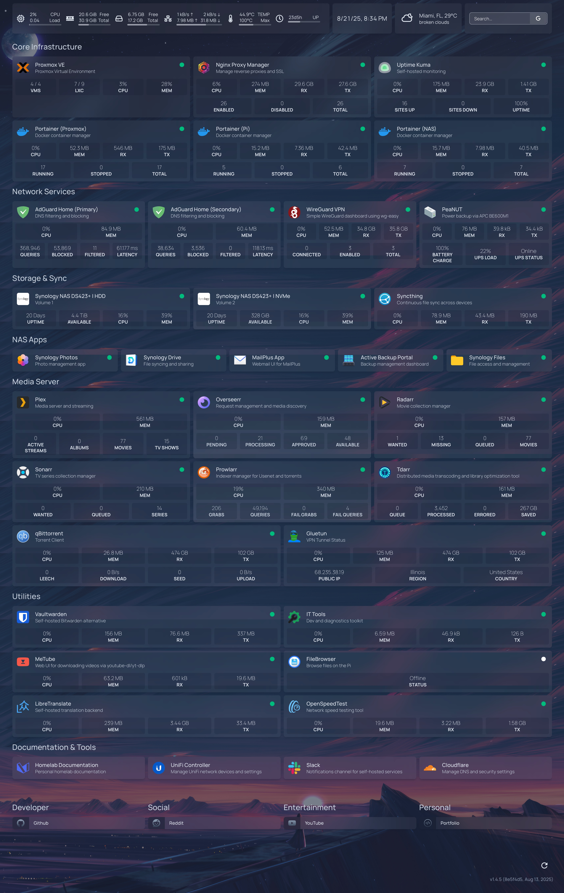
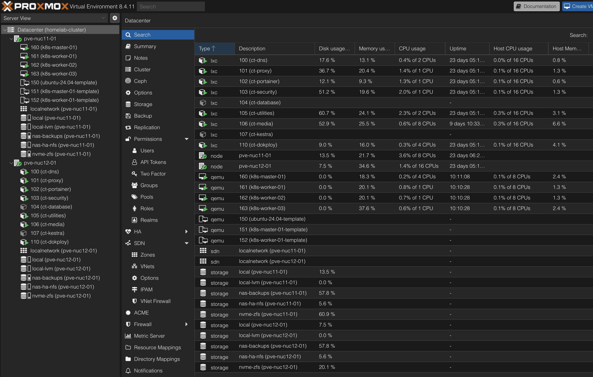

# Homelab – Infrastructure Overview

I operate a **production-grade, cloud-inspired homelab** designed for **high availability, automation, and resilience**. It demonstrates practical expertise in building and maintaining modern infrastructure with **Proxmox, Kubernetes, Docker, ZFS, and GitOps workflows**. All services and stacks are defined as code, ensuring full reproducibility and enabling transparent review of my practices.

## Skills Snapshot

- **Infrastructure & Clustering** – Proxmox HA, Kubernetes, Docker, ZFS, Synology NAS
- **Automation & CI/CD** – GitOps, GitHub Actions, Portainer Stacks, Dokploy
- **Observability & Ops** – Uptime Kuma, Dozzle, Kestra (workflow orchestration)
- **Networking & Security** – Cloudflare Zero Trust, VLANs, WireGuard VPN, firewalls
- **Backup & DR** – ZFS replication, multi-tier NAS + cloud backups





---

## Compute & Clustering

- **Proxmox 2-node HA cluster** with quorum device:

    - Intel NUC 12 (i5-1240P, SSD + NVMe/ZFS)
    - Intel NUC 11 (i5-1145G7, SSD + NVMe/ZFS)
    - Raspberry Pi 5 (8GB RAM, NVMe) as **QDevice** and secondary service host.

- **HA groups & replication**:

    - Automated failover with <3 min downtime.
    - ZFS replication between nodes reduces data loss to <15 minutes.
    - NUC 11 prioritizes Kubernetes VMs (1 master + 3 workers).
    - NUC 12 prioritizes LXC workloads running Docker stacks managed by Portainer.

- **Workload strategy**:

    - **LXCs** for lightweight, reproducible Dockerized services.
    - **VMs** for Kubernetes experimentation and production-grade orchestration.

---

## Deployment & Automation

- **Portainer GitOps**:

    - Stacks reconciled directly from GitHub.
    - CI/CD pipeline with GitHub Actions enforces linting, Compose validation, and secret scanning (TruffleHog).
    - Host-level secret injection for reproducibility without exposing sensitive data.

- **Dokploy**:

    - GitHub webhook-triggered builds for websites and applications.
    - Automated provisioning, scaling, and database backups.
    - Config/state backups to Cloudflare R2 for DR readiness.

- **Supporting ecosystem**:

    - **Kestra** – workflow orchestration & automation.
    - **Dozzle** – real-time log streaming.
    - **Uptime Kuma** – monitoring & alerting.
    - **Vaultwarden** – secrets management + automated encrypted backups.

---

## Networking & Security

- **Ubiquiti UniFi Express 7 router** + **2.5GbE managed switch** with VLAN segmentation.
- **Cloudflare integration**:

    - External services are proxied through Cloudflare, hiding my home IP while providing caching, optimization, and DDoS protection.
    - Cloudflare Zero Trust policies applied for per‑service identity‑based access.
    - Automated TLS management via Cloudflare API.

- **Ingress & DNS**:

    - Nginx Proxy Manager for internal routing and cert management.
    - Dual **AdGuard Home** instances (Proxmox LXC + Raspberry Pi) for DNS filtering and redundancy.

- **Remote access**:

    - WireGuard VPN for encrypted external access.
    - Strict firewall rules with service-specific port whitelisting.

---

## Storage & Backup

- **ZFS-backed NVMe storage** on each node for snapshots, replication, and HA.
- **Synology DS423+ NAS** (2×12TB HDD in SHR + dual NVMe SSD cache/volume):

    - NFS mounts for large media and raw storage.
    - Multi-tier backup pipeline:

        1. Proxmox snapshots → NAS
        2. NAS → Cloud (Google Drive/OneDrive) + local SSD

    - Enables one-click recovery of VMs and LXCs.

- **NVMe read cache** accelerates hot workloads.

---

## Design Principles

- **Cloud-centric architecture**: Designed locally, but mirrors enterprise HA/DR best practices.
- **Resilient by default**: ZFS snapshots, replication, automated failover.
- **Security-first**: VLAN isolation, Cloudflare Zero Trust, VPN-only ingress, least-privilege firewall rules.
- **Efficient resource use**: LXCs for light workloads, VMs for Kubernetes education and orchestration.
- **Scalable & automated**: GitOps-driven deployments, webhook-triggered CI/CD, and multi-layered backups.

---

## Outcome

This homelab showcases my ability to:

- Design and operate **highly available, production-like infrastructure**.
- Apply **modern DevOps practices** (GitOps, CI/CD, IaC, observability).
- Manage **secure, automated, and reproducible deployments** at scale.
- Integrate **backup, monitoring, and orchestration** into a cohesive, cloud-grade system.

It reflects the **hands-on engineering mindset** required of Site Reliability and DevOps Engineers: building systems that are **resilient, automated, observable, and secure**—not just theoretically, but in practice.

---

## Service & Stack Reference (Detailed)

<details>
<summary>Click to expand</summary>

```
stacks/
  ├── dns/                     # DNS + config sync
  │   ├── docker-compose.yaml  # adguardhome, adguardhome-sync
  │   └── stack.env.example
  │
  ├── homepage/                # Homelab dashboard
  │   ├── docker-compose.yaml  # homepage
  │   └── stack.env.example
  │
  ├── kestra/                  # Workflow orchestration
  │   ├── docker-compose.yaml  # postgres, kestra
  │   └── stack.env.example
  │
  ├── mariadb/                 # Relational DB + admin
  │   ├── docker-compose.yaml  # mariadb, phpmyadmin
  │   └── stack.env.example
  │
  ├── media/                   # Media apps
  │   ├── docker-compose.yaml  # prowlarr, radarr, sonarr, plex, overseerr, maintainerr, tdarr, recyclarr, flaresolverr, metube
  │   └── stack.env.example
  │
  ├── media-vpn/               # VPN-protected downloads
  │   ├── docker-compose.yaml  # gluetun, qbittorrent, deunhealth
  │   └── stack.env.example
  │
  ├── openweb-ui/              # Local LLM UI + meta search
  │   ├── docker-compose.yaml  # open-webui, searxng
  │   └── stack.env.example
  │
  ├── reverse-proxy/           # Public reverse proxy
  │   └── docker-compose.yaml  # nginx-proxy-manager
  │
  ├── utilities/               # Tools & monitoring
  │   ├── docker-compose.yaml  # uptimekuma, dozzle, it-tools, libretranslate, openspeedtest, peanut
  │   └── stack.env.example
  │
  ├── vaultwarden/             # Password manager + backups
  │   ├── docker-compose.yaml  # vaultwarden, vaultwarden-backup
  │   └── stack.env.example
  │
  └── wireguard/               # VPN server
      ├── docker-compose.yaml  # wg-easy
      └── stack.env.example
```

- Each directory = one **stack** (a set of related services).

---

- **dns/** – _AdGuard Home + adguardhome-sync_: network-wide DNS filtering, policy replication, and API-driven config.
- **reverse-proxy/** – _Nginx Proxy Manager_: HTTP(S) ingress, TLS via Cloudflare API, stream (SMTP/IMAP/POP3) proxying.
- **wireguard/** – _WG‑Easy_: secure remote access, opinionated defaults, audited iptables rules.
- **utilities/** – _Uptime Kuma, Dozzle, IT‑Tools, LibreTranslate, OpenSpeedTest, Peanut_:

    - **Uptime Kuma**: black‑box monitoring & alerting.
    - **Dozzle**: live container logs; remote agents for multi‑node visibility.
    - **Peanut**: tunnel / remote access UI with auth.
    - **LibreTranslate** + **OpenSpeedTest** + **IT‑Tools**: internal tooling surface.

- **homepage/** – _getHomepage_: single-pane-of-glass dashboard sourced from environment variables and APIs.
- **media/** – _Prowlarr, Radarr, Sonarr, Plex, Overseerr, Maintainerr, Tdarr, Recyclarr, FlareSolverr, MeTube_:

    - Shows **event‑driven automation**, **GPU/VA‑API transcoding**, shared NFS volumes, and service-to-service auth keys.

- **media-vpn/** – _Gluetun + qBittorrent + Deunhealth_: policy‑routed egress behind WireGuard, health‑gated app start.
- **mariadb/** – _MariaDB + phpMyAdmin_: stateful services separated from app stacks; custom ini/config mounts.
- **vaultwarden/** – _Vaultwarden + backup_: secrets vault + scheduled encrypted backups (retention, timestamping).
- **kestra/** – _Kestra + Postgres_: workflow orchestration with externalized DB, healthchecks, and ephemeral workdirs.
- **openweb-ui/** – _Open‑WebUI + SearxNG_: local LLM UI and meta search; host socket isolation and bind‑mounted data.

**Secrets & Config Strategy**

- Code & Compose in Git; **`stack.env.example`** committed for reproducibility.
- Real secrets injected at the **Portainer host/stack level** (and/or Vaultwarden), not stored in Git.
- CI enforces YAML style, Compose validity, and **verified** secret scanning.

</details>
