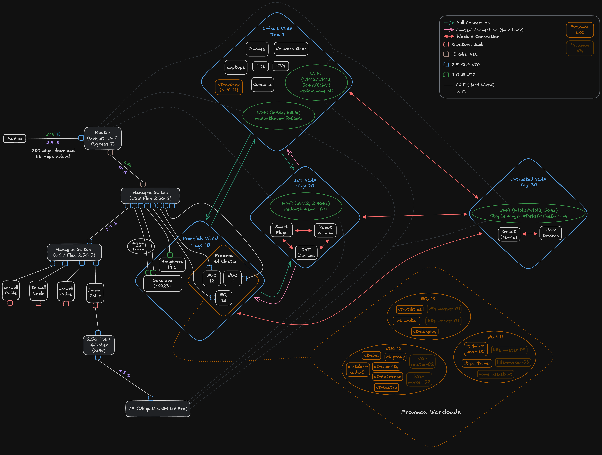
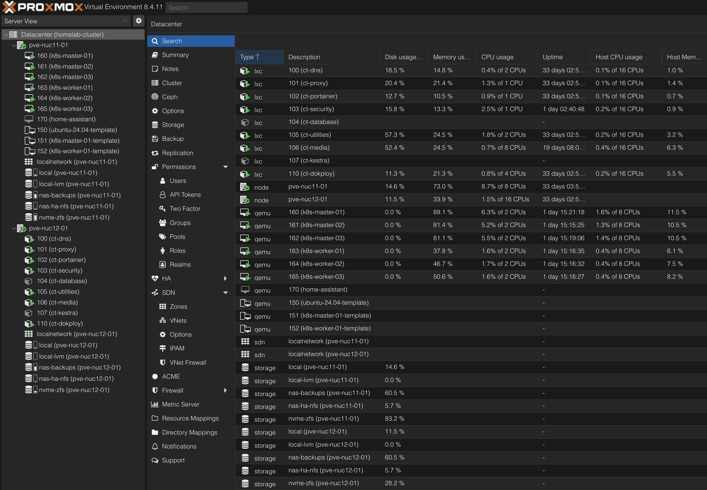
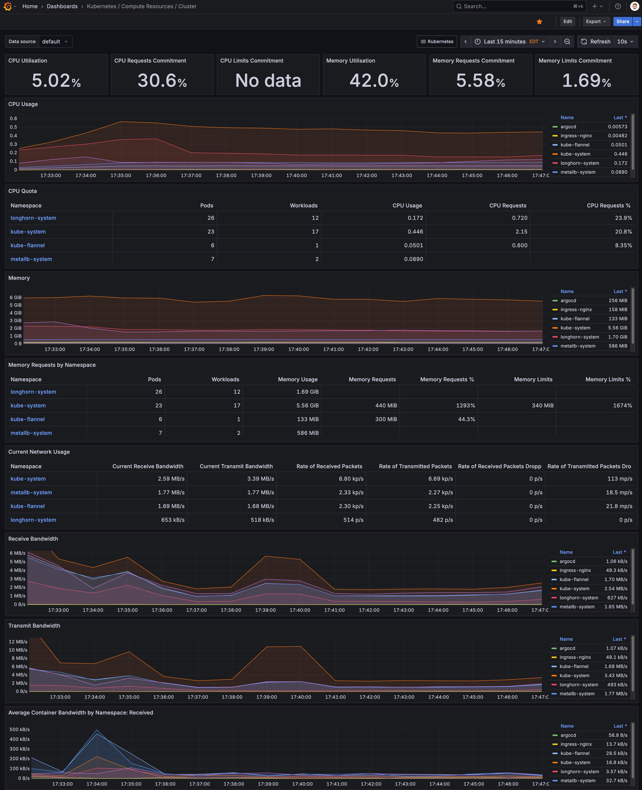
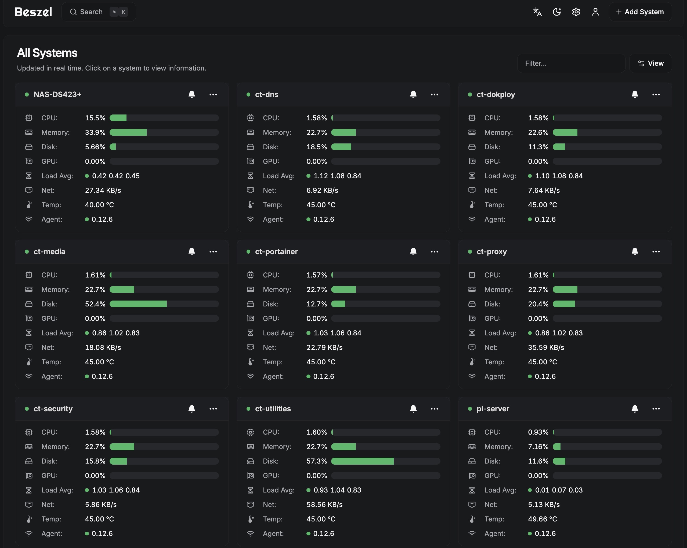
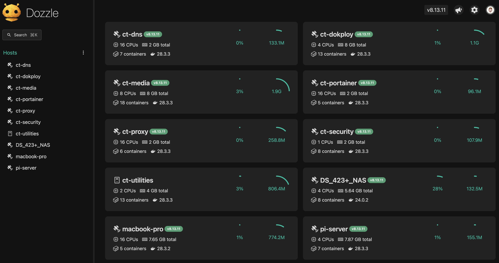
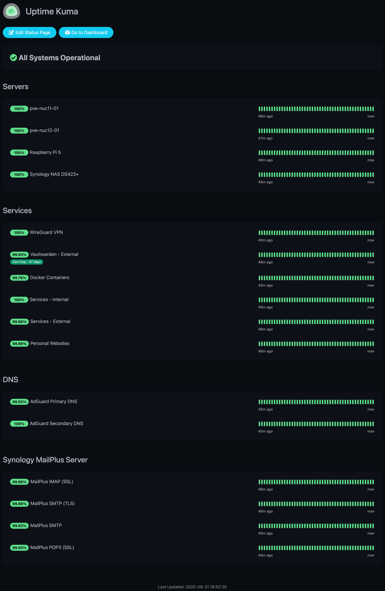
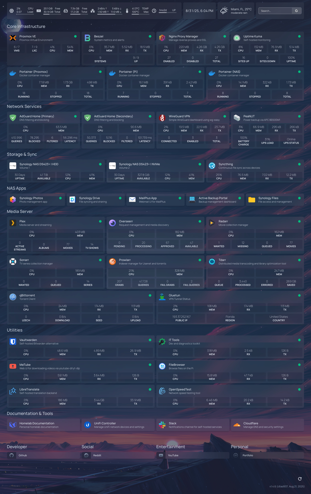

# Homelab – Cloud-Inspired Infrastructure

[](https://github.com/av1155/homelab/actions/workflows/ci.yaml)

> **TL;DR:**
> This homelab is a **production-like environment** designed for **high availability, automation, observability, and resilience**.
> It demonstrates hands-on experience with **Proxmox clustering, Docker operations, Kubernetes platform engineering, GitOps, CI/CD, Cloudflare Zero Trust, backups, and monitoring**.
> All services are defined as code in this repo.

This project is my **personal lab** and represents the real-world DevOps/SRE skills I bring:

- Automating deployments with **GitOps & CI/CD**
- Designing for **high availability and disaster recovery**
- Operating **secure, cloud-centric infrastructure**
- Building **observable, scalable, reproducible systems**

---

## Key Docs

- [**Kubernetes HA Platform Setup**](./kubernetes/README.md)  
  Step-by-step HA cluster config: kube-vip, MetalLB, Longhorn, backups, Prometheus/Grafana, Argo CD.
- [**Homelab Inventory & Cloud Cost Comparison**](./homelab_inventory.md)  
  Hardware, one-time spend, AWS-equivalent monthly cost, and 3-year savings.
- [**DevOps Roadmap**](./ROADMAP.md)  
  Phased plan from baseline safety → Packer → Terraform → Ansible → Vault → full IaC.

---

## Skills Snapshot

- **Infrastructure & Clustering** – Proxmox HA, Docker, kubeadm Kubernetes HA design/operations, ZFS, Synology NAS, Longhorn
- **Automation & IaC** – GitOps, Argo CD, GitHub Actions, Portainer GitOps (planned: Terraform modules and Ansible Playbooks for Proxmox/AWS)
- **Observability & Ops** – Prometheus + Grafana, Beszel, Uptime Kuma, Dozzle, Kestra
- **Networking & Security** – Cloudflare Proxy + Zero Trust, NPM (LXC) with in-cluster NGINX Ingress + MetalLB, AdGuard Home (dual DNS), VLAN segmentation, WireGuard VPN, firewall rules
- **Backup & DR** – ZFS replication, Synology NAS (Hyper Backup + cloud sync), Cloudflare R2 off-site storage

---

## Stats at a Glance

- **GitOps:** 14 stacks · 46 containers
- **Portainer-managed fleet (all environments):** 29 stacks · 95 containers across 11 Docker environments
- **Resilience:** **RTO ≤ 3m** (Proxmox HA), **RPO ≈ 15m** (ZFS replication)
- **Monitoring:** Prometheus + Grafana dashboards · 64 checks in Uptime Kuma · 10 hosts in Dozzle · 10 systems in Beszel
- **Availability snapshot:** Core infra **100%** · Exposed Services **99.79%** · Personal Websites **99.93%**

---

## Architecture Overview

- **Segmented network design** with dedicated VLANs for default clients, homelab infrastructure, IoT, and untrusted devices
- **Clear workload placement** across Proxmox nodes, Kubernetes control-plane/worker VMs, and supporting LXCs
- **Hybrid edge + core flow** from UniFi/Cloudflare ingress through reverse proxying to internal services

_Network and infrastructure topology:_


---

## Compute & Clustering

- **Proxmox 3-node HA cluster** (HA failover; ZFS snapshots/replication) → 40 vCPUs, 96 GB RAM
- **Workload separation**:
    - **LXCs** → lightweight Dockerized services (Portainer managed)
    - **VMs** → Kubernetes platform topology (**3 control planes + 3 workers**)

_Proxmox Dashboard:_


---

## Kubernetes Platform

- **Architecture:** kubeadm, 3 control planes + 3 workers on Proxmox VMs
- **Networking stack:** Flannel CNI, MetalLB for LoadBalancer IPs, NGINX Ingress
- **Storage stack:** Longhorn HA volumes with Synology NFS backup targets
- **Platform operations:** kube-vip control-plane VIP, etcd snapshots, ingress routing, Argo CD workflows
- **Observability stack:** Prometheus + Grafana with persistent dashboards
- **Edge model:** TLS terminates at Nginx Proxy Manager, fronted by Cloudflare proxy/DNS

[Full K8s config](./kubernetes/README.md)

---

## Deployment & Automation

- **GitOps with Portainer**
    - Docker Compose stacks reconciled directly from GitHub
    - GitHub Actions: linting, Compose validation, secret scanning (TruffleHog), image scanning (Trivy)
    - Host-level secret injection (no secrets in Git)
    - Portainer runs in a dedicated HA LXC, with **Portainer Agents + baseline agents** deployed across all nodes/devices:
        - `portainer-agent` – centralized Docker management
        - `beszel-agent` – metrics & alerting
        - `dozzle-agent` – log aggregation
        - `docker-socket-proxy` – secure Docker API access
        - `watchtower` – automated updates & Slack reporting  
          **Deployed on 11 Docker environments → 29 stacks / 95 containers total**

- **External app deployments (Dokploy, outside this repo)**
    - Webhook-triggered deployments for custom apps (Flask, Next.js, static sites, etc.)
    - Docker Swarm cluster deployments with horizontal scaling
    - Automated DB backups stored in **Cloudflare R2 (S3-compatible)** for durability & DR

---

## Monitoring & Observability

The homelab uses a **multi-layer monitoring stack** for real-time metrics, logs, uptime, and dashboards — combining **Prometheus + Grafana, Beszel, Dozzle, and Uptime Kuma**.  
This provides **end-to-end visibility**, proactive SMTP alerts, and lightweight dashboards.

### Prometheus + Grafana

- Collects cluster-wide metrics (Kubernetes, containers, nodes)
- Grafana dashboards for long-term visibility and troubleshooting
- Persistent storage ensures historical metrics are retained across restarts

_Grafana Dashboard:_  


### Beszel

- **Agents deployed** on all LXCs, the NAS (DS423+), and the Raspberry Pi
- Tracks CPU, memory, disk, network, GPU, load averages, and temperatures
- Alert thresholds: downtime (10m), CPU >80%, memory >80%, disk >80%, temp >85°C

_Beszel Dashboard:_  


### Dozzle

- Centralized Docker log visibility via lightweight agents
- Enables quick debugging and operational awareness

_Dozzle Logs View:_  


### Uptime Kuma

- External + internal uptime checks for services and infrastructure
- 64 checks configured, complementing Beszel + Dozzle

_Uptime Kuma Dashboard:_  


---

## CI/CD

This repository uses a **CI/CD pipeline** to ensure every stack stays **valid, secure, and ready for Portainer GitOps deployment**.

### What’s enforced

- **Workflow & docs linting** – consistent workflows and clean documentation
- **YAML & Compose checks** – validate syntax and Docker Compose configs per stack
- **Secrets scanning** – block commits containing verified secrets
- **Image scanning** – daily scheduled Trivy runs + PR changed-scope scans detect CRITICAL CVEs
- **Security gates** – strict CI gate blocks merge if required checks fail

---

## Networking & Security

- **Ubiquiti UniFi Express 7 router** + 2.5GbE managed switch (VLAN segmentation)
- **Cloudflare Integration**
    - All external services proxied through Cloudflare (DDoS protection, TLS, Zero Trust)
    - Automated certificate management via Cloudflare API

- **Ingress & DNS** – Nginx Proxy Manager, dual AdGuard Home DNS servers
- **Remote Access** – WireGuard VPN, strict firewall + per-service port rules

[Full security documentation](./SECURITY.md)

---

## Storage & Backups

- **ZFS NVMe pools** on each node → snapshots + HA replication
- **Synology DS423+ NAS** (2×12TB HDD SHR + dual NVMe SSD)
    - NFS for large media / raw storage
    - Multi-tier backup pipeline:
        1. Proxmox snapshots → NAS
        2. NAS → Cloud (Google Drive / OneDrive) + local SSD

- **Cloudflare R2** → app/DB backup storage

_Homelab Dashboard:_


---

## Services & Stacks

Here’s a quick overview (full configs in [`stacks/`](stacks/)):

| Stack                | Services (examples)                                                              | Purpose / Keywords                          |
| -------------------- | -------------------------------------------------------------------------------- | ------------------------------------------- |
| **dns**              | AdGuard Home, adguardhome-sync                                                   | DNS filtering, redundancy                   |
| **reverse-proxy**    | Nginx Proxy Manager                                                              | TLS, ingress, Cloudflare API integration    |
| **wireguard**        | WG-Easy                                                                          | VPN server, secure remote access            |
| **utilities**        | Beszel, Uptime Kuma, Dozzle, IT-Tools, OpenSpeedTest, Peanut, Excalidraw         | Monitoring, logs, internal tooling          |
| **vaultwarden**      | Vaultwarden + backup                                                             | Secrets mgmt, encrypted scheduled backups   |
| **media**            | Plex, Sonarr, Radarr, Overseerr, Prowlarr, Tdarr, Profilarr, Audiobookshelf      | Media automation, GPU/VA-API transcoding    |
| **media-vpn**        | Gluetun, qBittorrent, Deunhealth                                                 | VPN-protected egress, health-gated startup  |
| **media-monitoring** | Prometheus, Grafana, Node Exporter, cAdvisor, Plex Exporter                      | Media & host metrics, dashboards            |
| **mariadb**          | MariaDB, phpMyAdmin                                                              | Relational DB + admin UI                    |
| **kestra**           | Kestra, Postgres                                                                 | Workflow orchestration, job automation      |
| **openwebui**        | Open WebUI, SearxNG                                                              | Local LLM interface + meta search           |
| **homepage**         | getHomepage                                                                      | Single-pane dashboard                       |
| **portainer**        | Portainer CE                                                                     | Container management, GitOps orchestration  |
| **upsnap**           | UpSnap                                                                           | Wake-on-LAN management                      |

---

## Repo Structure

```text
ansible/             # (planned) Ansible roles and playbooks — Phase 3
docs/
  ├── adr/           # Architecture Decision Records — Phase 8
  ├── proxmox/       # Proxmox operational notes and runbooks
  ├── runbooks/      # Stack rollback and operational runbooks — Phase 0
  └── sre/           # SLOs, DR drills, incident reports — Phase 7
host-templates/      # Compose templates deployed directly on LXCs/VMs (agents, Tdarr nodes)
kubernetes/          # K8s manifests (kube-vip, MetalLB, Longhorn, Argo CD, monitoring)
packer/              # (planned) Proxmox base image templates — Phase 1
stacks/
  ├── dns/               # DNS stack
  ├── homepage/          # Dashboard
  ├── kestra/            # Workflow orchestration
  ├── mariadb/           # Database stack
  ├── media/             # Plex + automation
  ├── media-monitoring/  # Prometheus + Grafana
  ├── media-vpn/         # VPN-protected egress
  ├── openwebui/         # Local LLM + search
  ├── portainer/         # Container management
  ├── reverse-proxy/     # Nginx Proxy Manager
  ├── upsnap/            # Wake-on-LAN
  ├── utilities/         # Monitoring & tools
  ├── vaultwarden/       # Secrets vault + backup
  └── wireguard/         # VPN
terraform/           # (planned) Terraform modules for Proxmox provisioning — Phase 2
```

Most stack directories include:

- `docker-compose.yaml` – services & configs
- `stack.env.example` – reproducible environment variables

---
