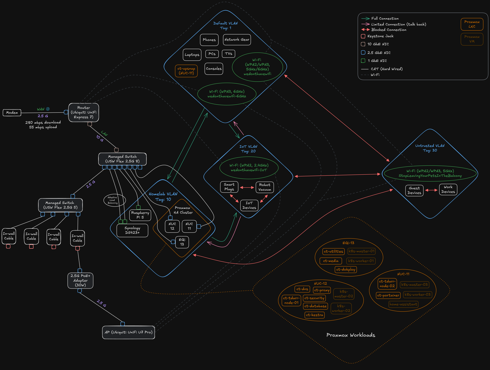

# Network Security

This document outlines the security architecture protecting the homelab infrastructure.

---

## Edge Protection

All HTTP/HTTPS traffic routes through **Cloudflare**:

- DDoS mitigation and WAF
- Real IP hidden behind Cloudflare proxy
- Port 443 restricted to [Cloudflare IP ranges](https://www.cloudflare.com/ips/) at the router level — direct IP access is blocked

**Cloudflare Zero Trust** protects sensitive services with SSO (Google/GitHub) and email-based 2FA:

- Portainer, Synology DSM, AdGuard Home, WireGuard UI
- Vaultwarden admin, phpMyAdmin, Uptime Kuma
- Homepage dashboard, Beszel, UpSnap, IT-Tools, Homelab Docs

---

## Network Segmentation

Four VLANs with zone-based firewall policies:

| VLAN      | Tag | Purpose                            | Isolation                                                   |
| --------- | --- | ---------------------------------- | ----------------------------------------------------------- |
| Default   | 1   | Personal devices                   | Full LAN access                                             |
| Homelab   | 10  | Infrastructure (Proxmox, NAS, K8s) | Full LAN access                                             |
| IoT       | 20  | Smart devices                      | Internet only, no LAN access, no inter-device communication |
| Untrusted | 30  | Guest/work devices                 | Internet only, fully isolated                               |

---

## Intrusion Detection & Prevention

UniFi IDS/IPS enabled on Default, Homelab, and IoT networks:

- Mode: Notify and Block
- Signatures auto-updated
- Active detections: Botnets, malware, exploits, P2P/dark web, protocol vulnerabilities

**GeoIP blocking** (incoming): Pakistan, India, Brazil, Romania, Turkey, China, Nepal, Russia, Afghanistan, Bangladesh

**Honeypot** deployed on Default network (10.0.1.2)

---

## Authentication Layers

Critical services are protected by up to three authentication layers:

1. **Cloudflare Zero Trust** — SSO + 2FA before traffic reaches the network
2. **NPM Access List** — Basic auth (username/password) at the reverse proxy
3. **Service-native auth** — Application login + 2FA where applicable

---

## Exposed Services

| Service   | Port(s)                          | Protection                                    |
| --------- | -------------------------------- | --------------------------------------------- |
| Web (NPM) | 443                              | Cloudflare proxy, Zero Trust where applicable |
| WireGuard | 51820                            | Cryptographic authentication                  |
| Plex      | 32400                            | Plex authentication, invite-only              |
| Mail      | 25, 587, 993, 995                | SMTP auth, SPF/DKIM/DMARC                     |
| Sunshine  | 47984, 47989, 48010, 47998-48000 | Encrypted, PIN + certificate pairing          |

---

## DNS

Dual AdGuard Home instances (primary + secondary) with:

- DNS rewrites for local resolution (bypasses external routing for LAN traffic)
- Sync between instances via adguardhome-sync

---

## Remote Access

WireGuard VPN for secure remote management. VPN clients have full access to Internal and Gateway zones.
